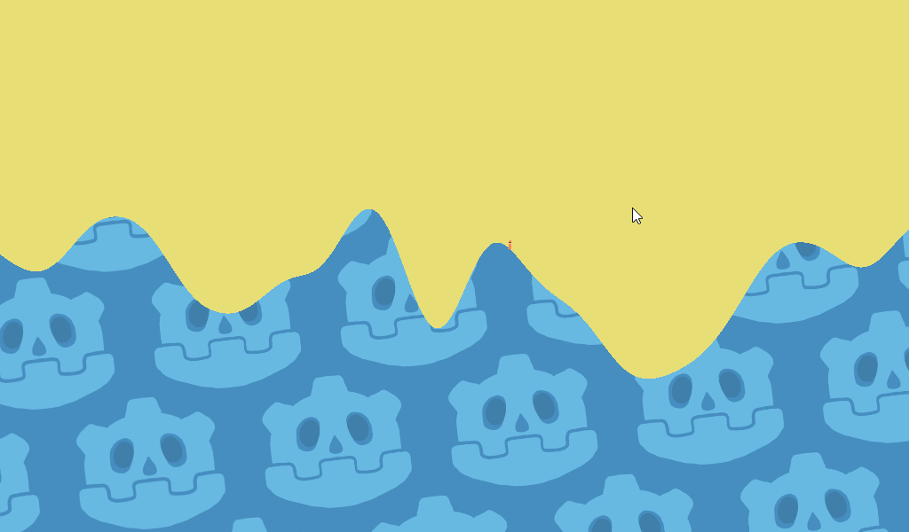

# Destructable Terrain Demo

## Inspiration

[The Worms Series](https://en.wikipedia.org/wiki/Worms_%28series%29) is known for their destructable terrain.

I wanted to recreate this mechanic in Godot.

## Tutorial

There's a video version of the tutorial [here](https://youtu.be/vousewr1dUA).

In short, here are the steps to follow:

1. Set up random map generation (with [OpenSimplexNoise](https://docs.godotengine.org/en/stable/classes/class_opensimplexnoise.html)).
2. Keep a copy of the sprite map in a 2d array.
3. Write your own physics engine.
    1. Calculate the normals for each pixel based upon its surroundings.
    2. Apply forces to moving objects.
